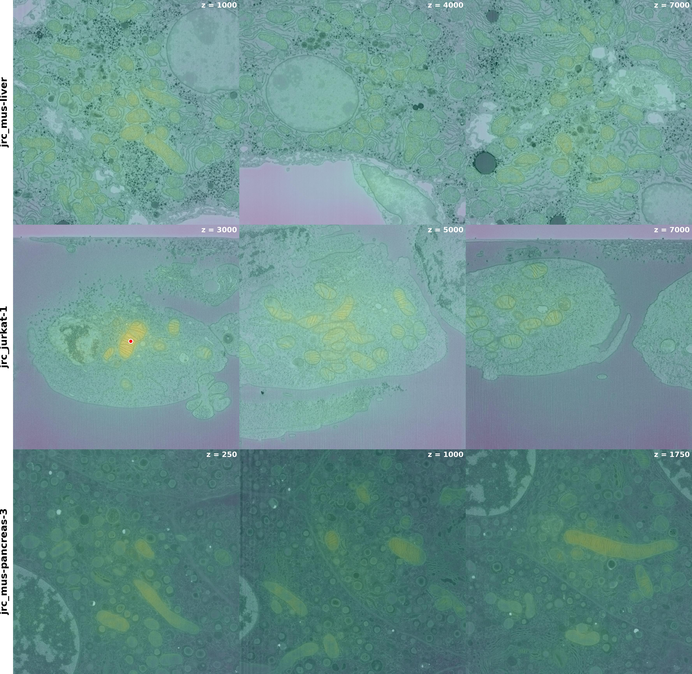
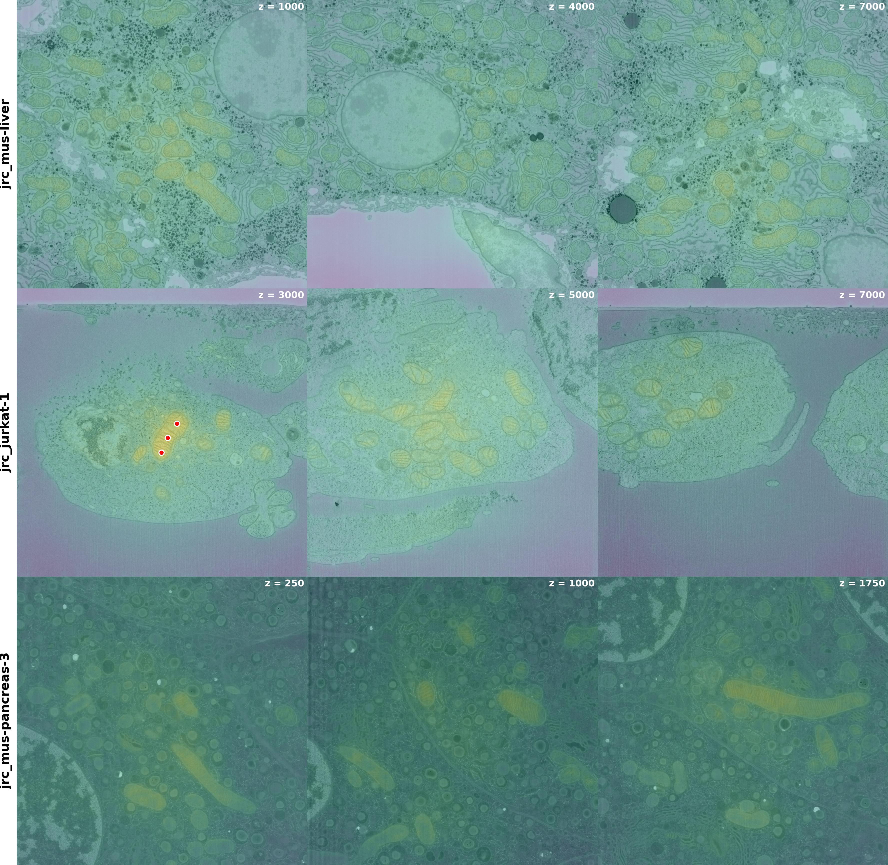
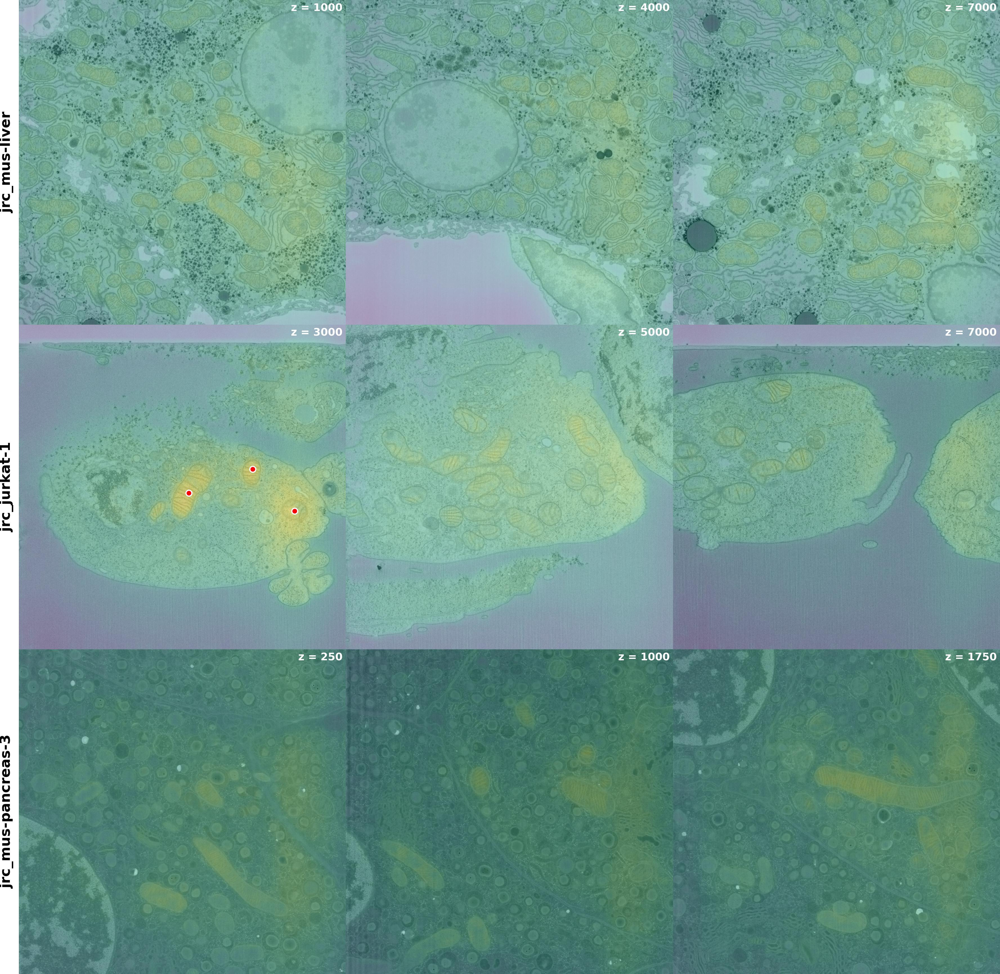

## Embedding experiments with DINOv3 models on EM images from OpenOrganelle
### Setup
* Create a new python `venv` and activate it (or feel free to use your own favorite project manager instead):

```console
~$ python -m venv task2venv
~$ source task2venv/bin/activate
```

* Clone this repo and `cd` into it:
```console
(task2venv) ~$ git clone https://github.com/eminorhan/task2.git
(task2venv) ~$ cd task2
```

* Install the required dependencies. If you have an NVIDIA GPU:
```console
(task2venv) ~/task2$ pip install -r requirements-cuda.txt
```

* Otherwise, for the CPU only version:
```console
(task2venv) ~/task2$ pip install -r requirements-cpu.txt
```

### Downloading the data
We will use the following volumes from [OpenOrganelle](https://openorganelle.janelia.org/) in the experiments below:

* `jrc_mus-liver` ([neuroglancer link](https://neuroglancer-demo.appspot.com/#!%7B%22dimensions%22:%7B%22x%22:%5B1e-9%2C%22m%22%5D%2C%22y%22:%5B1e-9%2C%22m%22%5D%2C%22z%22:%5B1e-9%2C%22m%22%5D%7D%2C%22position%22:%5B50458%2C49276%2C34801%5D%2C%22crossSectionOrientation%22:%5B0%2C1%2C0%2C0%5D%2C%22crossSectionScale%22:50%2C%22projectionOrientation%22:%5B0%2C1%2C0%2C0%5D%2C%22projectionScale%22:65536%2C%22layers%22:%5B%7B%22type%22:%22image%22%2C%22source%22:%22zarr://s3://janelia-cosem-datasets/jrc_mus-liver/jrc_mus-liver.zarr/recon-1/em/fibsem-uint8/%22%2C%22tab%22:%22source%22%2C%22opacity%22:1%2C%22blend%22:%22additive%22%2C%22shader%22:%22#uicontrol%20invlerp%20normalized%28range=%5B105%2C%20182%5D%2C%20window=%5B0%2C%20255%5D%29%5Cn#uicontrol%20vec3%20color%20color%28default=%5C%22white%5C%22%29%5Cnvoid%20main%28%29%7BemitRGB%28color%20%2A%20normalized%28%29%29%3B%7D%22%2C%22name%22:%22fibsem-uint8%22%7D%5D%2C%22selectedLayer%22:%7B%22visible%22:true%2C%22layer%22:%22fibsem-uint8%22%7D%2C%22crossSectionBackgroundColor%22:%22#000000%22%2C%22layout%22:%22xy%22%7D))
* `jrc_jurkat-1` ([neuroglancer link](https://neuroglancer-demo.appspot.com/#!%7B%22dimensions%22:%7B%22x%22:%5B1e-9%2C%22m%22%5D%2C%22y%22:%5B1e-9%2C%22m%22%5D%2C%22z%22:%5B1e-9%2C%22m%22%5D%7D%2C%22position%22:%5B19998.5%2C5998.5%2C14721.5%5D%2C%22crossSectionOrientation%22:%5B0%2C1%2C0%2C0%5D%2C%22crossSectionScale%22:50%2C%22projectionOrientation%22:%5B0%2C1%2C0%2C0%5D%2C%22projectionScale%22:65536%2C%22layers%22:%5B%7B%22type%22:%22image%22%2C%22source%22:%22zarr://s3://janelia-cosem-datasets/jrc_jurkat-1/jrc_jurkat-1.zarr/recon-1/em/fibsem-uint8/%22%2C%22tab%22:%22source%22%2C%22opacity%22:1%2C%22blend%22:%22additive%22%2C%22shader%22:%22#uicontrol%20invlerp%20normalized%28range=%5B219%2C%20234%5D%2C%20window=%5B0%2C%20255%5D%29%5Cn#uicontrol%20vec3%20color%20color%28default=%5C%22white%5C%22%29%5Cnvoid%20main%28%29%7BemitRGB%28color%20%2A%20normalized%28%29%29%3B%7D%22%2C%22name%22:%22fibsem-uint16%22%7D%5D%2C%22selectedLayer%22:%7B%22visible%22:true%2C%22layer%22:%22fibsem-uint16%22%7D%2C%22crossSectionBackgroundColor%22:%22#000000%22%2C%22layout%22:%22xy%22%7D))
* `jrc_mus-pancreas-3` ([neuroglancer link](https://neuroglancer-demo.appspot.com/#!%7B%22dimensions%22:%7B%22x%22:%5B1e-9%2C%22m%22%5D%2C%22y%22:%5B1e-9%2C%22m%22%5D%2C%22z%22:%5B1e-9%2C%22m%22%5D%7D%2C%22position%22:%5B9598.5%2C9838.5%2C4118.5%5D%2C%22crossSectionOrientation%22:%5B0%2C1%2C0%2C0%5D%2C%22crossSectionScale%22:50%2C%22projectionOrientation%22:%5B0%2C1%2C0%2C0%5D%2C%22projectionScale%22:65536%2C%22layers%22:%5B%7B%22type%22:%22image%22%2C%22source%22:%22zarr://s3://janelia-cosem-datasets/jrc_mus-pancreas-3/jrc_mus-pancreas-3.zarr/recon-1/em/fibsem-uint16%22%2C%22tab%22:%22source%22%2C%22opacity%22:1%2C%22blend%22:%22additive%22%2C%22shader%22:%22#uicontrol%20invlerp%20normalized%28range=%5B955%2C%20658%5D%2C%20window=%5B0%2C%202000%5D%29%5Cn#uicontrol%20vec3%20color%20color%28default=%5C%22white%5C%22%29%5Cnvoid%20main%28%29%7BemitRGB%28color%20%2A%20normalized%28%29%29%3B%7D%22%2C%22name%22:%22fibsem-uint16%22%7D%5D%2C%22selectedLayer%22:%7B%22visible%22:true%2C%22layer%22:%22fibsem-uint16%22%7D%2C%22crossSectionBackgroundColor%22:%22#000000%22%2C%22layout%22:%22xy%22%7D))

You can download these volumes with the [`download.py`](download.py) script provided here, *e.g.*:
```console
(task2venv) ~/task2$ python -u download.py
```
This script implements several robust downloading features, such as graceful resumption of partial downloads and download retries with exponential backoff in case of connection failures. By default, this script will create a new directory called `data` and download the volumes under it.

### Downloading the pretrained DINOv3 checkpoints
First, copy my own clone of the DINOv3 repository:
```console
(task2venv) ~$ git clone https://github.com/eminorhan/dinov3.git
```
This version implements a few extensions to the original [DINOv3](https://github.com/facebookresearch/dinov3) repo, such as 3D backbones and FlashAttention-3 for Hopper GPUs (although we won't really need to use these features for the demos below).

Then, you will need to obtain the download links for the pretrained checkpoints from Meta, as described [here](https://github.com/facebookresearch/dinov3) (note that this requires submitting the form [here](https://ai.meta.com/resources/models-and-libraries/dinov3-downloads/) to request access). Once you have the download links, create a new Torch Hub checkpoints directory and download the checkpoints there (alternatively, you can use your own existing Torch Hub directory here, if you know where it is), *e.g.* using `wget`:
```console
(task2venv) ~$ mkdir -p torch_hub/checkpoints
(task2venv) ~$ cd torch_hub/checkpoints
(task2venv) ~torch_hub/checkpoints$ wget -O dinov3_vitl16_pretrain_lvd1689m-8aa4cbdd.pth "DOWNLOAD_URL"
```
For the demos below, you don't have to download all checkpoints, `dinov3_vitl16_pretrain_lvd1689m-8aa4cbdd.pth` should be sufficient.

### Extracting feature embeddings with pretrained DINOv3 models
The embedding functions are implemented in [`embed.py`](embed.py). 

**Patch size selection:** We will use the highest resolution EM data contained in `s0` to compute the embeddings. The volumes were imaged at a resolution of ~4-8 nm (per dimension) and mitochondria have typical lengths of ~1-4 μm and diameters of ~0.2-1 μm, so even though data at coarser levels (*e.g.* `s1` or `s2`) can still have enough detail to resolve many of the structural features of individual mitochondria, we will achieve the largest possible degree of spatial detail by using the highest resolution data in `s0`. 

**Per-patch and per-pixel (dense) embeddings:** By passing images through DINOv3 models, we can obtain per-patch embeddings (the common patch size for all DINOv3 models is 16x16 pixels). For an image of size `(H, W)`, this corresponds to an embedding size of `(D, H // patch_size, W // patch_size)`. In order to obtain per-pixel or dense embeddings, we can simply upsample the per-patch embeddings by interpolation, *e.g.*:
```python
pixel_embeddings = F.interpolate(patch_embeddings, size=(H, W), mode="bilinear", align_corners=False)
```
Note that this will interpolate each embedding dimension independently. This will produce a per-pixel embedding of size `(D, H, W)` for a given image. The embedding functions in [`embed.py`](embed.py) implement both per-patch and per-pixel embeddings, which can be controlled by the `embed_mode` parameter (`'pixel'` or `'patch'`).

### Embedding-based retrieval and visualization
The [`run.py`](run.py) script is the main script that will run the embedding-based similarity analysis and generate the resulting visualizations. For this analysis, we selected three regions of interest from each of the three volumes, containing multiple mitochondria as well as displaying other interesting, rich subcellular structures. The regions are all 2048 x 2048 pixels in size (large enough to contain a lot of diverse, interesting sptial structures, but small enough to fit into the context window of DINOv3 models without tiling). These regions were selected through manual exploration of the neuroglancer views of each volume (links above). In addition, we identified several query locations containing mitchondria, to be used as query vectors in our embedding-based similarity analysis. The spatial coordinates of these regions of interest and queries are provided in the [`selected_crops.json`](selected_crops.json) file.

As our first example, we can take a look at the following figure, which shows the embedding-based similarity maps between a query location (represented by the red dot) in one of our regions of interest and all other locations in all 9 regions of interest both within the same volume, *i.e.* `jrc_jurkat-1`, and across different volumes (different rows).

**`single query:`**


When there are multiple queries, we have different options for computing embedding-based similarities. Perhaps the simplest option would be to average the query vectors and compute the similarity scores between the average vector and all other vectors. This option may make more sense when the query vectors are more similar to each other (*i.e.* located on the same mitochondrion), so that averaging produces a more prototypical, less noisy query. Another option, which may be more preferable when the queries are more heterogeneous (*i.e.* located on different mitochondria or on different volumes), is to compute the similarity with respect to each query separately and then take the maximum over them. This is analogous to a logical XOR between the queries and is also known as a MaxSim operator in information retrieval. 

The code currently implements both of these strategies, which can be controlled by the `method` argument (`'average'` or `'maxsim'`) in the `compute_similarity()` function implemented [here](retrieve.py). 

The following figures show multi-query examples using the `average` and `maxsim` methods, respectively. The query locations are again indicated by the red dots.

**`multi-query (average):`**


**`multi-query (maxsim):`**


By providing more varied examples of what a mitochondrion might look like, multiple queries with the `maxsim` method generally lead to similarity maps that capture more of the mitochondria both within and across volumes.

Running `run.py` will generate all three figures above for a given model and save them in a folder called `visuals`. More examples can be found in the [`visuals`](visuals) folder.

### Strategies for parameter-efficient finetuning
To improve the mitochondria detection and segmentation performance of the DINOv3 backbones in a parameter-efficient way, we again have a few different options.

**Training light-weight detection/segmentation heads on frozen backbones:** We can freeze a pretrained DINOv3 backbone and only train light-weight detection/segmentation heads on top of the frozen backbone, *e.g.* a linear segmentation head on top of the final feature map of the backbone or on top of the concatenation of a few different feature maps across the model layers (to capture different types of visual information: more high-level *vs.* low-level). A model like this could be trained on mitochondrial segmentation masks using supervised training objectives, *e.g.* binary cross-entropy or focal loss between the per-pixel segmentation labels (mitochondrion *vs.* not) and upsampled model predictions.

**Low-rank adaptation (LoRA):** Another popular approach for parameter-efficient finetuning for downstream tasks is low-rank adaptation (LoRA). In many cases, simply training a light-weight detection/segmentation head on top of the frozen backbone may not be good enough if the downstream domain is sufficiently different from the pretraining data of the backbone. In such cases, we would need to adapt the backbone to the new domain as well. LoRA achieves this in a parameter-efficient way by adding trainable low-rank matrices to a subset of the model's own weight matrices (*i.e.* W + AB, where only A and B are trainable and AB is low-rank), *e.g.* typically the query and value projection matrices inside the self-attention layers of the model. These trainable low-rank matrices allow the backbone to adapt to the new domain in a parameter efficient way. The new LoRA weights can be trained either with self-supervised objectives, like the DINOv3 objective, or with supervised objectives as in the previous case.

**Adapter modules:** Another way to adapt the backbone to a new domain in a parameter efficient way is to insert new light-weight trainable modules in between the existing modules in a backbone. Similar to LoRA, adapters typically have an hourglass-like bottleneck structure in order to reduce their parameter count: *e.g.* a down projection (projection to a lower dimensional space), followed by a nonlinear activation and then an up projection, plus a residual pathway to allow the model to use its original information flow path. Similar to LoRA, adapter modules can also be trained with self-supervised or supervised objectives.